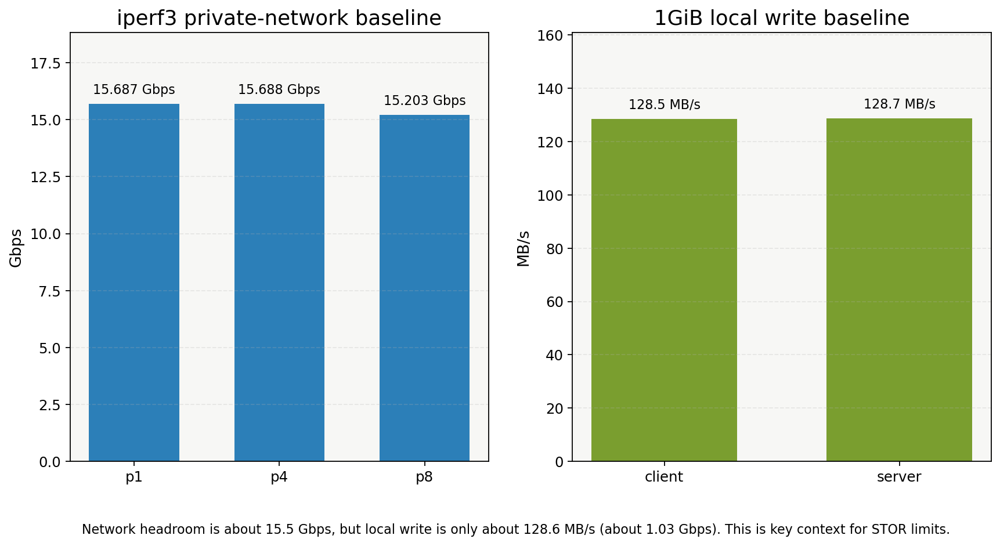
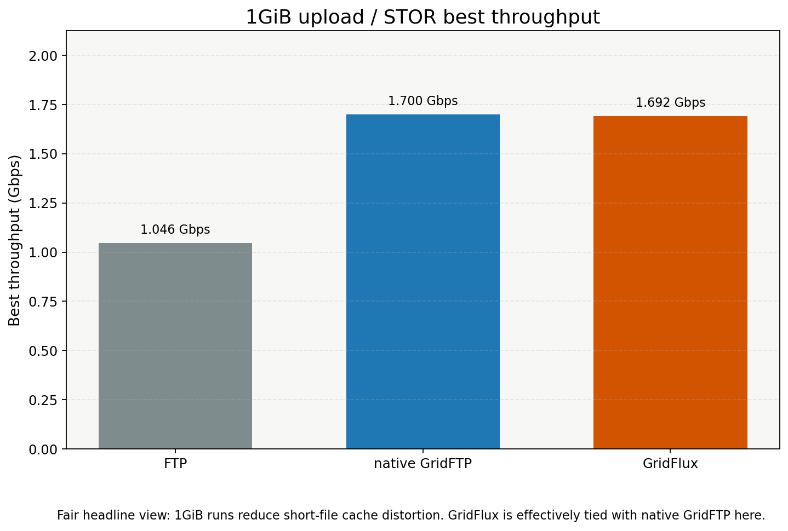
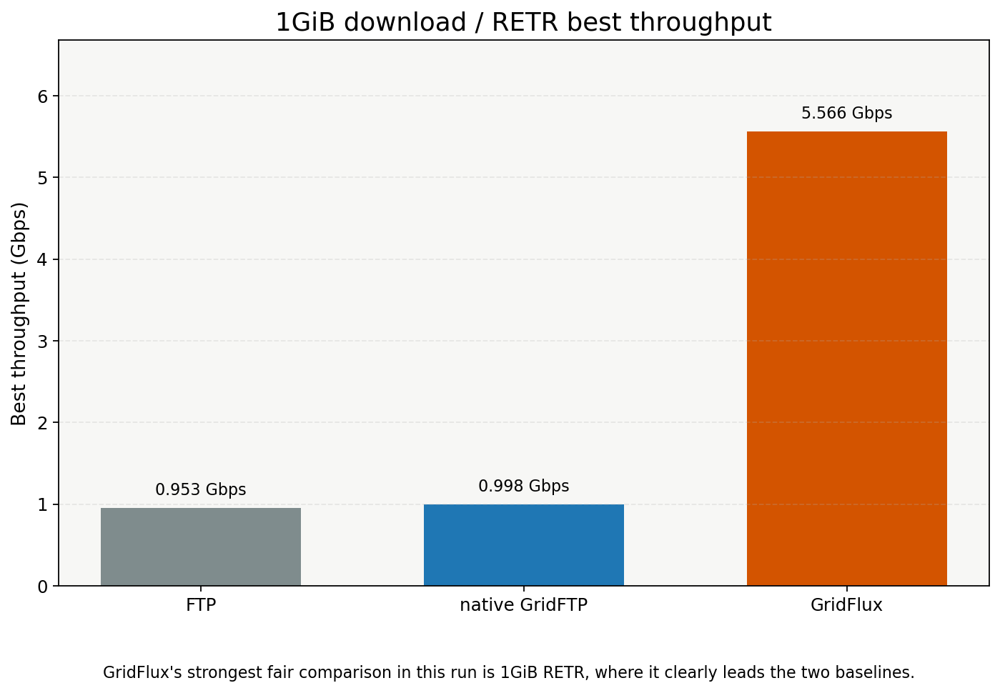
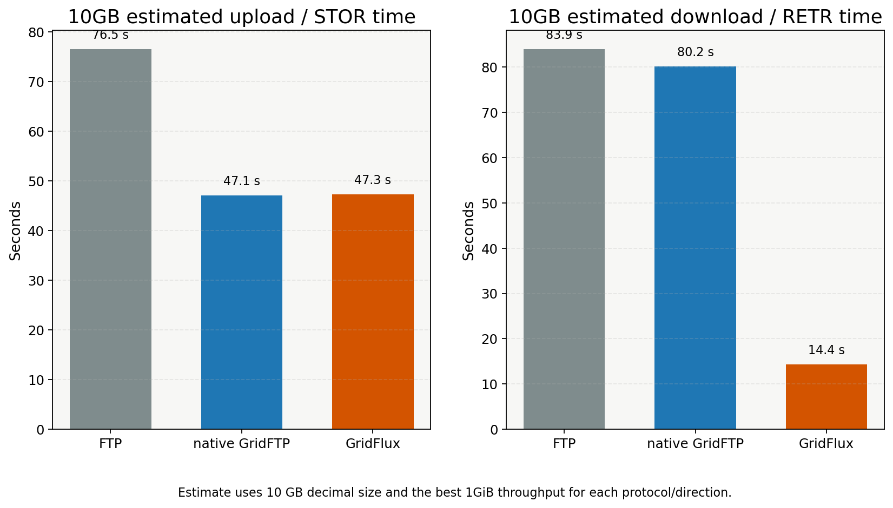
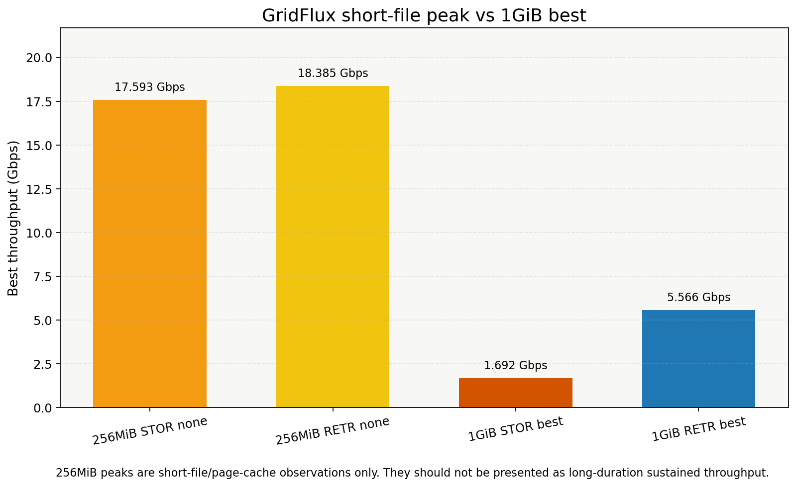

# GridFlux Beta Performance Summary

This document summarizes the Beta 1A/1B/1C performance closeout and the
FTP / native GridFTP / GridFlux comparison on the current two Alibaba Cloud
servers. It is not a 100G validation.

## Default Strategy

The default beta strategy remains unchanged:

- `auth-mode=anonymous`
- `tls-mode=off`
- `data-tls-mode=off`
- `file_io_backend=posix`
- `final_verify_policy=full`
- `manifest_flush_policy=every_n_chunks`
- `preallocate=off`
- `posix_write_strategy=auto`
- `receiver_write_profile=default`
- `receiver_write_yield_policy=none`

## Host Baseline

The final three-way run `20260520T120942Z` recorded:

| baseline | result |
| --- | --- |
| iperf3 private TCP p1 | `15.687 Gbps` |
| iperf3 private TCP p4 | `15.688 Gbps` |
| iperf3 private TCP p8 | `15.203 Gbps` |
| server `/tmp` 1GiB write | `128.731 MB/s` (`1.030 Gbps`) |
| client `/tmp` 1GiB write | `128.512 MB/s` (`1.028 Gbps`) |

The network has much more headroom than the observed single-disk write path.
That context explains why STOR remains writeback-bound on this environment.

## FTP / GridFTP / GridFlux Comparison

Final valid comparison run: `20260520T120942Z`.

| protocol | direction | 1GiB best | note |
| --- | --- | --- | --- |
| plain FTP | upload | `1.046 Gbps` | single-stream baseline |
| native GridFTP | upload | `1.700 Gbps` | parallelism 4 |
| GridFlux | STOR | `1.692 Gbps` | connections 8, checksum none |
| plain FTP | download | `0.953 Gbps` | single-stream baseline |
| native GridFTP | download | `0.998 Gbps` | parallelism 8 |
| GridFlux | RETR | `5.566 Gbps` | connections 8, checksum none |

GridFlux STOR is effectively tied with native GridFTP on 1GiB upload and both
are faster than plain FTP. GridFlux RETR is clearly faster than both plain FTP
and native GridFTP in this run. All quoted comparison rows are hash-consistent.

The 256MiB GridFlux peaks are short-file/page-cache observations only and are
not a long-run throughput promise.

## STOR Summary

Beta 1B found that STOR is dominated by receiver temp write/writeback and the
cloud storage stack:

- Beta 1B-2: temp-write wall share was the dominant STOR stage.
- Beta 1B-3: opt-in drain-budget bounded profile produced local wins and
  regressions, not a stable default-worthy gain.
- Beta 1B-4: bounded/dirty_poll stability matrix had matched improvements and
  regressions; user-space queue design is not justified yet.
- Beta 1B-5: storage/system attribution points to disk/filesystem/cloud-volume,
  page cache, and OS writeback behavior before GridFlux feature work.

Manifest flush, final verify, and rename/commit remain visible in reports, but
they are not the primary STOR bottleneck in the current environment.

## Cloud Disk Bottleneck Proof

Beta follow-up adds `tools/perf/run_cloud_disk_bottleneck_proof.py` for a
targeted attribution run on the current Alibaba Cloud pair. It collects
bidirectional iperf3, CRC32C hardware/software/auto, memory/sink if available,
`gridflux-storage-bench` write/read, and aligned GridFlux STOR/RETR stage
metrics in one window. The generated report is
`docs/perf/CLOUD_DISK_BOTTLENECK_PROOF.md`.

The proof rule is intentionally conservative: network and CRC32C must be far
above STOR, storage write must be the same order as STOR, STOR temp-write wall
share must exceed 60%, and data receive share must remain small before the
report labels the current STOR bottleneck as cloud disk/writeback dominated.
This remains an Alibaba Cloud conclusion only, not a 100G certification.

## Cloud Disk Bottleneck Proof Status

| run | size | result | verdict | use |
| --- | ---: | --- | --- | --- |
| `20260521T130648Z` | 64MiB | pass | `inconclusive_or_mixed` | toolchain smoke only |
| `20260521T145615Z` | 1GiB/4GiB repeat=3 | pass | `inconclusive_or_mixed` | formal attribution |

The focused run confirms a strong negative case for network and CRC32C hardware
as STOR bottlenecks: private TCP reached `15.695 Gbps`, CRC32C hardware reached
`47.821 Gbps`, and GridFlux transfer hash mismatches were `0`. It also shows
native storage write median `0.954 Gbps` and GridFlux STOR e2e median
`0.977 Gbps`, so STOR remains in the same order as the storage path. However,
the conservative proof rule did not flip to `cloud_disk_writeback_dominated`
because focused STOR temp-write wall share median was `37.3%`, below the 60%
threshold, while data receive share stayed small at `1.1%`. The formal verdict
therefore remains mixed: current Alibaba Cloud storage/writeback is a major
limiting context, but this run does not prove it is the only dominant STOR
stage under the strict rule.

## RETR Summary

Beta 1C RETR focused validation passed correctness and hash checks. The dominant
pressure alternates between sender network-send and receiver download temp-write,
depending on file size, connection count, checksum, and cache/writeback state.
Throughput spread is still high enough that defaults should not change.

## TLS / Data TLS

Control TLS and STOR/RETR data TLS are implemented and validated as opt-in
capabilities. Beta matrices show TLS/data TLS can impose noticeable overhead,
especially in small or mixed workloads. They remain off by default.

## Checksum

CRC32C hardware is not the main bottleneck in the current environment.
`checksum=none` can improve some performance rows, especially short or
download-heavy rows, but CRC32C remains the safe default for integrity-oriented
beta testing.

## io_uring

The file-IO-only `io_uring` backend is implemented as opt-in and passes real
io_uring CTest smoke when available. Across Beta 1A/1B/1C, it does not show a
stable default-worthy gain over POSIX.

## Recommended Opt-In Test Combos

Use these only for diagnostics:

- `checksum=none` to isolate checksum overhead.
- `file_io_backend=io_uring` for focused file-IO backend comparisons.
- `final_verify_policy=verified_chunks` only with CRC32C and verified-chunk
  safety conditions.
- `preallocate=full` for storage-specific A/B tests.
- `receiver_write_profile=bounded` and `receiver_write_yield_policy=dirty_poll`
  only for receiver writeback experiments.

## Why Defaults Stay Unchanged

No opt-in knob produced a stable, cross-direction, cross-workload improvement
without regressions. The default path remains conservative, reliable, and easy
to reason about while Beta Gate / Beta RC packages the current evidence.

## Beta 1E Freeze Boundary

Beta 1E freezes the current cloud-server Beta candidate with long soak and
freeze checks. It is not a 100G certification. Before 100G migration, collect
independent `iperf3`, `gridflux-storage-bench`, memory sink, and CRC32C
benchmark baselines; on the 100G hosts, run 10GiB GridFlux smoke before 100GiB
repeat tests.
