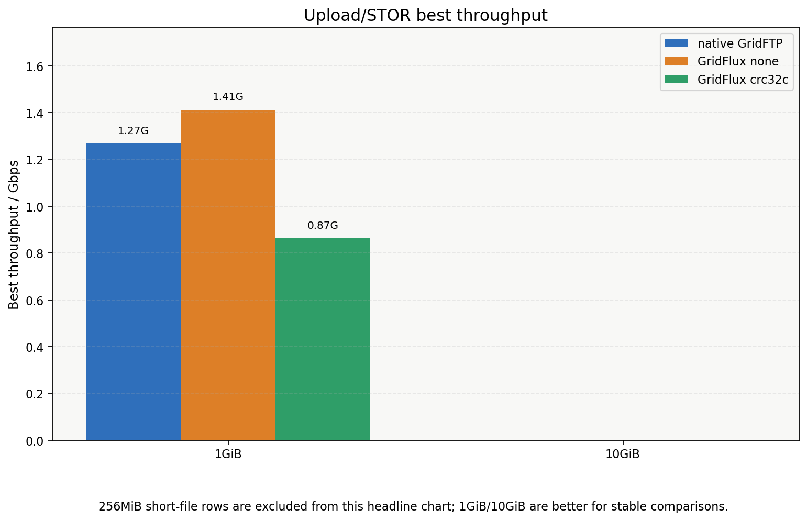
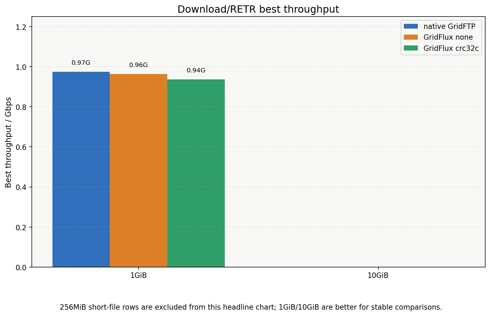
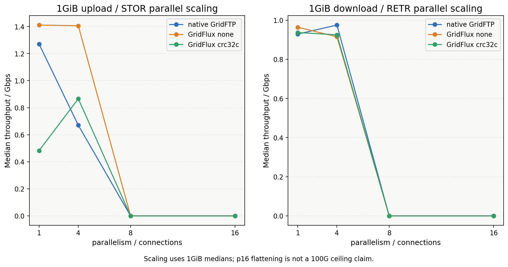
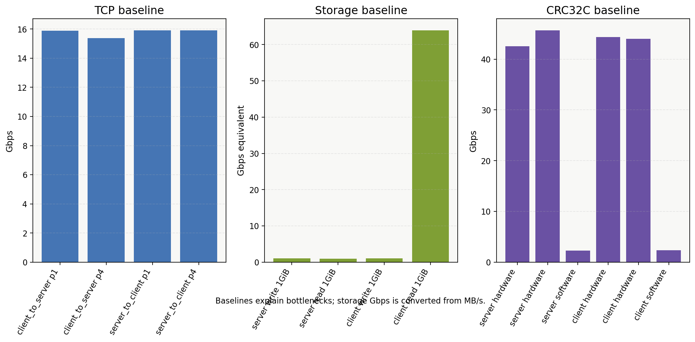
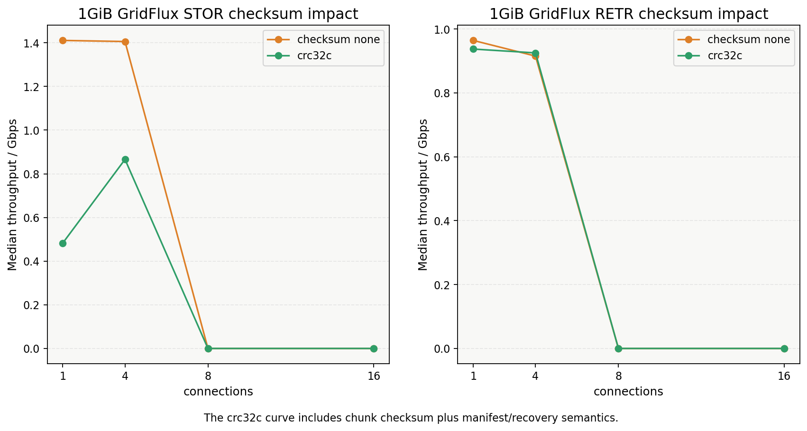
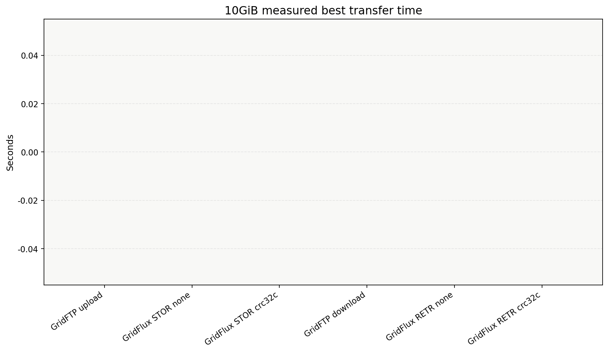

# 原生 GridFTP vs GridFlux 云服务器对比实验

生成时间：`2026-05-21T08:37:26Z`

数据状态：当前输入 CSV 只覆盖 `256MiB, 1GiB`；若这是 smoke run，4GiB/10GiB 完整展示结论仍需默认完整矩阵补齐。

## 1. 实验目的

在现有两台云服务器私网环境下，对比原生 Globus GridFTP 与当前 GridFlux Beta 冻结版的上传/下载吞吐、并发扩展、checksum 开销和大文件表现。本报告不是 100G 认证，也不改变 GridFlux 默认策略。

## 2. 实验环境

- 环境记录：`tools/perf/results/20260521T082732Z_gridftp-vs-gridflux-env.txt`
- Host baseline CSV：`tools/perf/results/20260521T081601Z_gridftp-vs-gridflux-host-baseline.csv`
- Checksum baseline CSV：`tools/perf/results/20260521T081601Z_gridftp-vs-gridflux-checksum-baseline.csv`
- Summary CSV：`tools/perf/results/20260521T082732Z_gridftp-vs-gridflux-cloud-summary.csv`
- 测试链路：<redacted>一 `<redacted>` 与<redacted>二 `<redacted>` 的私网链路。

## 3. 技术路径简述

- 原生 GridFTP：使用 `globus-gridftp-server` 与 `globus-url-copy`，通过 parallelism `1/4/8/16` 扩展数据传输。
- GridFlux：使用 GridFTP-like 控制面和 framed STOR/RETR 数据面；`checksum none` 更接近裸传输，`crc32c` 是带 chunk 校验、manifest 和恢复语义的可靠模式。
- 默认策略保持保守：anonymous、TLS off、data TLS off、POSIX、full final verify、manifest every_n_chunks、preallocate off、posix auto、receiver default/none。

## 4. 实验矩阵

- 文件大小：256MiB、1GiB、4GiB、10GiB。256MiB 仅作短文件/cache 观察。
- 原生 GridFTP：upload/download，parallelism `1/4/8/16`，1GiB repeat=3，其余默认 repeat=1。
- GridFlux：STOR/RETR，connections `1/4/8/16`，checksum `none/crc32c`，POSIX/off/off 主矩阵。
- GridFlux 小子集：1GiB io_uring、1GiB TLS/data TLS required/required，只用于说明 opt-in 开销或差异。

## 5. Baseline 结果

| kind | machine | operation | p | size | MB/s | Gbps | status |
| --- | --- | --- | --- | --- | --- | --- | --- |
| iperf3 | client_to_server | tcp | 1 |  |  | 15.894 | pass |
| iperf3 | client_to_server | tcp | 4 |  |  | 15.372 | pass |
| iperf3 | server_to_client | tcp | 1 |  |  | 15.911 | pass |
| iperf3 | server_to_client | tcp | 4 |  |  | 15.907 | pass |
| storage | server | write | 1 | 1GiB | 128.960 | 1.032 | pass |
| storage | server | read | 1 | 1GiB | 119.178 | 0.953 | pass |
| storage | client | write | 1 | 1GiB | 128.598 | 1.029 | pass |
| storage | client | read | 1 | 1GiB | 7992.600 | 63.941 | pass |

### CRC32C baseline

| machine | backend | size | Gbps | status |
| --- | --- | --- | --- | --- |
| server | hardware | 1GiB | 42.5136 | pass |
| server | hardware | 1GiB | 45.6851 | pass |
| server | software | 1GiB | 2.31614 | pass |
| client | hardware | 1GiB | 44.3513 | pass |
| client | hardware | 1GiB | 44.0036 | pass |
| client | software | 1GiB | 2.32846 | pass |

## 6. 原生 GridFTP 结果

| direction | size | p/conn | checksum | backend | tls | median Gbps | best Gbps | p95 | spread % | n | fail | mismatch |
| --- | --- | --- | --- | --- | --- | --- | --- | --- | --- | --- | --- | --- |
| download | 256MiB | 1 |  |  | off/off | 1.244 | 1.244 | 1.244 | 0.000 | 1 | 0 | 0 |
| download | 256MiB | 4 |  |  | off/off | 11.178 | 11.178 | 11.178 | 0.000 | 1 | 0 | 0 |
| download | 1GiB | 1 |  |  | off/off | 0.929 | 0.929 | 0.929 | 0.000 | 1 | 0 | 0 |
| download | 1GiB | 4 |  |  | off/off | 0.975 | 0.975 | 0.975 | 0.000 | 1 | 0 | 0 |
| upload | 256MiB | 1 |  |  | off/off | 8.838 | 8.838 | 8.838 | 0.000 | 1 | 0 | 0 |
| upload | 256MiB | 4 |  |  | off/off | 7.425 | 7.425 | 7.425 | 0.000 | 1 | 0 | 0 |
| upload | 1GiB | 1 |  |  | off/off | 1.270 | 1.270 | 1.270 | 0.000 | 1 | 0 | 0 |
| upload | 1GiB | 4 |  |  | off/off | 0.670 | 0.670 | 0.670 | 0.000 | 1 | 0 | 0 |

## 7. GridFlux 结果

| direction | size | p/conn | checksum | backend | tls | median Gbps | best Gbps | p95 | spread % | n | fail | mismatch |
| --- | --- | --- | --- | --- | --- | --- | --- | --- | --- | --- | --- | --- |
| retr | 256MiB | 1 | crc32c | posix | off/off | 7.996 | 7.996 | 7.996 | 0.000 | 1 | 0 | 0 |
| retr | 256MiB | 1 | none | posix | off/off | 16.496 | 16.496 | 16.496 | 0.000 | 1 | 0 | 0 |
| retr | 256MiB | 4 | crc32c | posix | off/off | 7.909 | 7.909 | 7.909 | 0.000 | 1 | 0 | 0 |
| retr | 256MiB | 4 | none | posix | off/off | 12.840 | 12.840 | 12.840 | 0.000 | 1 | 0 | 0 |
| retr | 1GiB | 1 | crc32c | posix | off/off | 0.937 | 0.937 | 0.937 | 0.000 | 1 | 0 | 0 |
| retr | 1GiB | 1 | none | posix | off/off | 0.964 | 0.964 | 0.964 | 0.000 | 1 | 0 | 0 |
| retr | 1GiB | 4 | crc32c | posix | off/off | 0.925 | 0.925 | 0.925 | 0.000 | 1 | 0 | 0 |
| retr | 1GiB | 4 | none | posix | off/off | 0.915 | 0.915 | 0.915 | 0.000 | 1 | 0 | 0 |
| retr | 1GiB | 8 | crc32c | io_uring | off/off | 0.966 | 0.966 | 0.966 | 0.000 | 1 | 0 | 0 |
| retr | 1GiB | 8 | crc32c | posix | required/required | 0.942 | 0.942 | 0.942 | 0.000 | 1 | 0 | 0 |
| stor | 256MiB | 1 | crc32c | posix | off/off | 7.287 | 7.287 | 7.287 | 0.000 | 1 | 0 | 0 |
| stor | 256MiB | 1 | none | posix | off/off | 15.060 | 15.060 | 15.060 | 0.000 | 1 | 0 | 0 |
| stor | 256MiB | 4 | crc32c | posix | off/off | 7.568 | 7.568 | 7.568 | 0.000 | 1 | 0 | 0 |
| stor | 256MiB | 4 | none | posix | off/off | 14.606 | 14.606 | 14.606 | 0.000 | 1 | 0 | 0 |
| stor | 1GiB | 1 | crc32c | posix | off/off | 0.483 | 0.483 | 0.483 | 0.000 | 1 | 0 | 0 |
| stor | 1GiB | 1 | none | posix | off/off | 1.411 | 1.411 | 1.411 | 0.000 | 1 | 0 | 0 |
| stor | 1GiB | 4 | crc32c | posix | off/off | 0.866 | 0.866 | 0.866 | 0.000 | 1 | 0 | 0 |
| stor | 1GiB | 4 | none | posix | off/off | 1.406 | 1.406 | 1.406 | 0.000 | 1 | 0 | 0 |
| stor | 1GiB | 8 | crc32c | io_uring | off/off | 0.719 | 0.719 | 0.719 | 0.000 | 1 | 0 | 0 |
| stor | 1GiB | 8 | crc32c | posix | required/required | 0.851 | 0.851 | 0.851 | 0.000 | 1 | 0 | 0 |

## 8. GridFTP vs GridFlux 对比

### 1GiB / 4GiB / 10GiB matched rows

| 方向 | 大小 | p/conn | GridFlux checksum | GridFTP median | GridFlux median | GridFlux delta | status |
| --- | --- | --- | --- | --- | --- | --- | --- |
| upload/stor | 1GiB | 1 | none | 1.270 | 1.411 | +11.1% | matched |
| upload/stor | 1GiB | 1 | crc32c | 1.270 | 0.483 | -62.0% | matched |
| upload/stor | 1GiB | 4 | none | 0.670 | 1.406 | +109.9% | matched |
| upload/stor | 1GiB | 4 | crc32c | 0.670 | 0.866 | +29.3% | matched |
| download/retr | 1GiB | 1 | none | 0.929 | 0.964 | +3.8% | matched |
| download/retr | 1GiB | 1 | crc32c | 0.929 | 0.937 | +0.9% | matched |
| download/retr | 1GiB | 4 | none | 0.975 | 0.915 | -6.2% | matched |
| download/retr | 1GiB | 4 | crc32c | 0.975 | 0.925 | -5.1% | matched |

### 最佳结果与 10GiB 预计耗时

| 场景 | 最佳样本大小 | p/conn | median Gbps | best Gbps | 按 best 传 10GiB |
| --- | --- | --- | --- | --- | --- |
| GridFTP upload | 1GiB | 1 | 1.270 | 1.270 | 67.6s |
| GridFTP download | 1GiB | 4 | 0.975 | 0.975 | 88.1s |
| GridFlux STOR none | 1GiB | 1 | 1.411 | 1.411 | 60.9s |
| GridFlux STOR crc32c | 1GiB | 4 | 0.866 | 0.866 | 99.2s |
| GridFlux RETR none | 1GiB | 1 | 0.964 | 0.964 | 89.1s |
| GridFlux RETR crc32c | 1GiB | 8 | 0.966 | 0.966 | 88.9s |

### GridFlux checksum 影响

| 方向 | 大小 | conn | none median | crc32c median | crc32c delta |
| --- | --- | --- | --- | --- | --- |
| RETR | 256MiB | 1 | 16.496 | 7.996 | -51.5% |
| RETR | 256MiB | 4 | 12.840 | 7.909 | -38.4% |
| RETR | 1GiB | 1 | 0.964 | 0.937 | -2.8% |
| RETR | 1GiB | 4 | 0.915 | 0.925 | +1.1% |
| STOR | 256MiB | 1 | 15.060 | 7.287 | -51.6% |
| STOR | 256MiB | 4 | 14.606 | 7.568 | -48.2% |
| STOR | 1GiB | 1 | 1.411 | 0.483 | -65.8% |
| STOR | 1GiB | 4 | 1.406 | 0.866 | -38.4% |

## 9. 结果分析

- 裸 TCP baseline best 为 `15.911 Gbps`，当前实验首先受云服务器私网能力约束，不代表 100G。
- 本地 storage write best 为 `1.032 Gbps`，STOR/upload 结果需要放在写盘/writeback 背景下理解。
- CRC32C benchmark best 为 `45.685 Gbps`，若远高于传输吞吐，则 checksum 通常不是主瓶颈。
- GridFlux STOR best 为 `15.060 Gbps`；若接近 storage write 上限，优先怀疑云盘、文件系统和 page cache/writeback。
- GridFlux RETR best 为 `16.496 Gbps`；下载方向更接近网络发送、接收端落盘和多连接调度共同作用。
- 并发是否有效以 matched rows 和 parallel scaling 图为准；p16 若没有继续提升，不应解释为协议绝对上限，可能是云服务器网络、CPU、写盘或 GridFTP 配置共同限制。
- 256MiB 短文件结果可能受 page cache 和短文件启动成本影响，不作为长期稳定上限承诺。

## 10. 图表

- 
- 
- 
- 
- 
- 

## 11. 结论

本轮结论必须以 hash 一致且 status pass 的 CSV 行为准。如果 GridFlux 在部分场景快于原生 GridFTP，可以作为当前 Beta 原型在该云服务器环境下的实测优势；如果没有全面更快，则应强调 GridFlux 的可靠恢复、manifest、checksum、event log、目录传输和后续优化空间，而不是伪造性能优势。

## 12. 局限性

- 当前云服务器裸 TCP 通常只有十几 Gbps 量级，不是 100G 环境。
- 当前 storage write 约 1Gbps 级时，上传/STOR 结论强烈受写盘和 OS writeback 影响。
- 原生 GridFTP 采用本轮临时 anonymous/no-GSI 配置，不代表所有生产 GridFTP 部署方式。
- GridFlux Beta 仍是云服务器候选版，不是 100G 认证版。

## 13. 后续 100G 环境验证计划

迁移 100G 前先跑 iperf3、storage bench、memory sink 和 CRC32C benchmark；100G 上先做 10GiB smoke，再做 100GiB repeat。只有当网络、磁盘、CPU、TLS 和 checksum baseline 都足够清晰后，才能判断 GridFlux 数据面是否成为主瓶颈。
